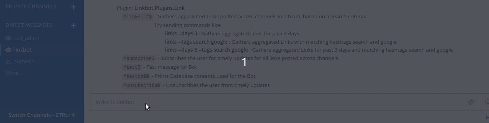
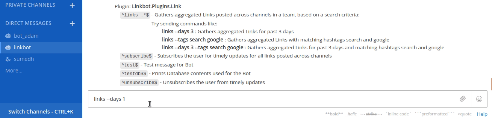
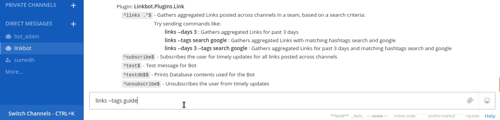
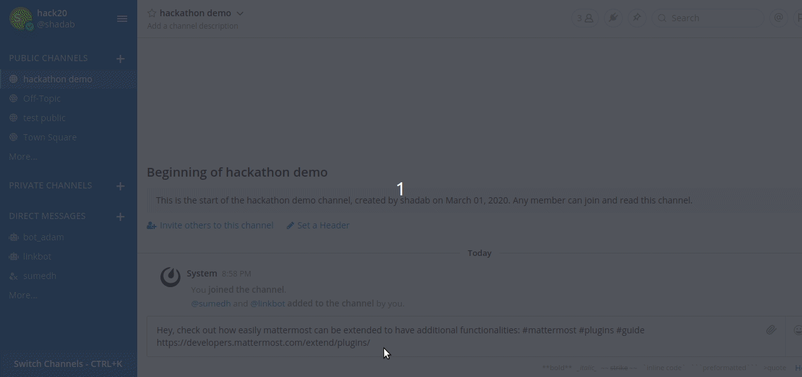
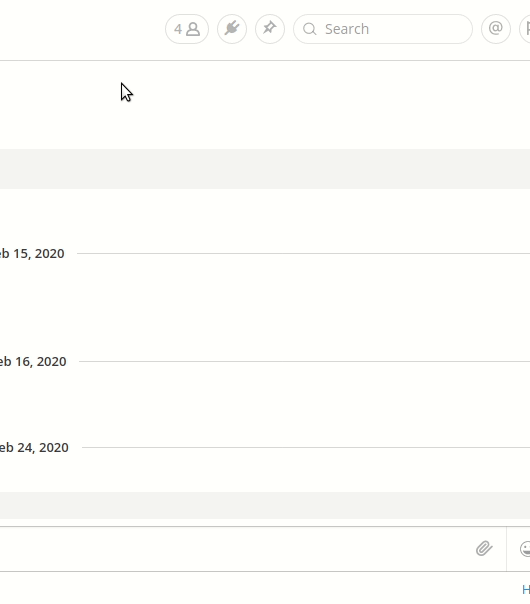

# Mattermost Linkbot Plugin

## Getting Started

* Clone this repo
* Edit `serverUrl` in `webapp/webpack.config.js` to Mattermost URL.
* Edit `ServeHTTP` function in `server/plugin.go` to reflect teamID and db location user by linkbot.
* Follow below steps:

Build your plugin:
```
make
```

This will produce a single plugin file (with support for multiple architectures) for upload to your Mattermost server:

```
com.github.shadabk96.mattermost-linkbot-plugin-0.1.0.tar.gz
```
In production, deploy and upload your plugin via the System Console.

## Demo

* Test message


* Search using --days option


* Search using --tags option


* Linkbot entries reflected in [UI plugin](https://github.com/shadabk96/mattermost-linkbot-plugin)


* Populated sidebar UI plugin  


* Subscribe and unsubscribe demo


## Coming soon
Due to the time constraints of the hackathon, we were not able to complete every functionality as planned. The development of this project is going on and more features will be added soon. 
* Auto generation of tags 
* Natural language search queries
* Personalized feed for user based on his channels and interests
* More options to subscribe. Eg: '--daily' '--weekly'
* Search options in UI Plugin
* Extending linkbot to files and images shared in the channel

## Authors

* Shadab Khan - [Github](https://github.com/shadabk96) | [LinkedIn](https://www.linkedin.com/in/shadabk96/)
* Sumedh Kale - [Github](https://github.com/sumedhkale) | [LinkedIn](https://www.linkedin.com/in/sumedh-kale/)

---

